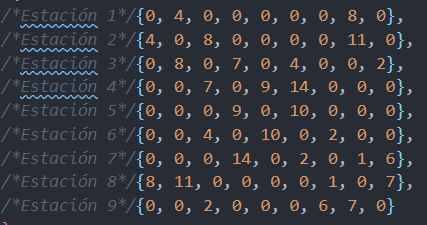
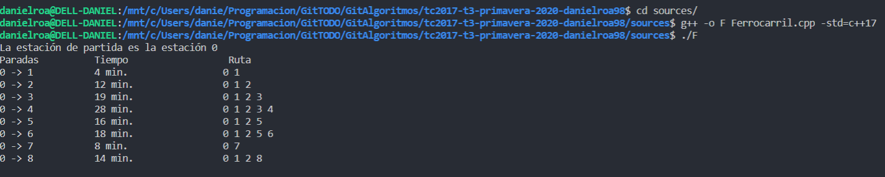

# Tarea 3. *Técnicas de diseño de algoritmos (Individual)*

---

##### Integrantes:
1. *Daniel Roa González* - *A01021960* - *Campus Santa Fe*

---
## 1. Aspectos generales

Las orientaciones de la tarea se encuentran disponibles en la plataforma **Canvas**.

Este documento es una guía sobre qué información debe entregar como parte de la tarea, qué requerimientos técnicos debe cumplir y la estructura que debe seguir para organizar su entrega.


### 1.1 Requerimientos técnicos

A continuación se mencionan los requerimientos técnicos mínimos de la tarea, favor de tenerlos presente para que cumpla con todos.

* El código debe desarrollarse en C++, cumpliendo con el último estándar [C++17](https://isocpp.org/std/the-standard).
* Toda la programación debe realizarse utilizando Programación Genérica.
* Deben utilizarse las [C++ Core Guidelines](https://github.com/isocpp/CppCoreGuidelines/blob/master/CppCoreGuidelines.md).
* Todo el código debe estar correctamente documentado, siguiendo los lineamientos que aparecen en [Documenting C++ Code](https://developer.lsst.io/cpp/api-docs.html).
* Todo el código de la tarea debe alojarse en este repositorio de GitHub.
* Debe configurar su repositorio para que utilice el sistema de Integración Continua [Travis CI](https://travis-ci.org/).

### 1.2 Estructura del repositorio

El proyecto debe seguir la siguiente estructura de carpetas:
```
- / 			        # Raíz del repositorio
    - README.md			# Archivo con la información general de la actividad (este archivo)
    - sources  			# Códigos fuente con la solución
    - examples			# Archivos de ejemplo que pueden utilizarse para verificar que la solución funciona.
```

## 2. Solución

Estos dos códigos se encargan de llevar a cabo diferentes funciones, uno se encarga de resolver el problema de las __Torres de Hanoi__ y el otro se encarga de resolver el problema de los ferrocarriles.

La programación de estos dos fue llevada a cabo utilizando recursión para que pueda mandar a llamar los datos anteriores que se estaban utilizando. Como ejemplo, esto se puede ver en la línea _27_ del programa [Torres de Hanoi](sources/TorresHanoi.cpp) y en la línea _39_ del programa [Ferrocarril](sources/Ferrocarril.cpp).

Para el programa de las __Torres de Hanoi__, lo que se intenta llevar a cabo es mover los platos (o discos) de la torre del principio hasta la última torre (la tercera). La meta es hacerlo con el menor número de movimientos para poder llevar a cabo. Hay diferentes versiones de este problema, pero la mas conocida/popular es la versión en la que se manejan 3 platos. Este problema se debe resolver en __7__ movimientos. La complejidad _O_ de este algoritmo es de: .

Para el programa de los horarios de un ferrocarril, se plantea que se debe buscar la ruta mas rápida para llegar a una parada. En el libro llamado __Técnicas de Diseño de Algoritmos__, se menciona que para poder solucionar esto, se puede programar una variante del algoritmo de Dijkstra, en el cual, se toma en cuenta el peso que se tiene entre las conexiones de cada nodo y, por ende, se toma en cuenta como si fuese el tiempo que le toma en llegar a cada una de las estaciones. Al ingresar al código, en el main se va a ver una tabla como la siguiente:  



Esos valores numéricos representan los tiempos que se encuentran entre las paradas correspondientes entre cada una de las paradas. La complejidad _O_ de este algoritmo es de: .

### 2.1 Pasos a seguir para utilizar la aplicación

*[Incluya aquí una guía paso a paso para poder utilizar la aplicación, desde la clonación del repositorio, la compilación del código hasta la ejecución de los ejemplos para visualizar los resultados.]*

Para poder correr estos programas, se deben de tener los siguientes programas instalados:

* Git
* gcc

De tal manera, para poder tener el repositorio deseado, es necesario correr el siguiente comando:

```
git clone https://github.com/tec-csf/tc2017-t3-primavera-2020-danielroa98.git
```

Después puede ingresar a la carpeta del repositorio llamada _tc2017-t3-primavera-2020-danielroa98_ usando el siguiente comando:
```
cd tc2017-t3-primavera-2020-danielroa98
```

A continuación podrá encontrar la instrucciones correspondientes para el programa deseado.

### 2.2 Torres de Hanoi
Para poder comenzar a correr el programa que contiene la solución de las __Torres de Hanoi__ es necesario ingresar a la carpeta llamada [sources](/sources) usando el siguiente comando en su terminal.

```
cd sources
```

Una vez que se encuentre dentro, podrá comenzar a correr el código al usar los siguientes comandos:
```
g++ -o TH TorresHanoi.cpp -std=c++17
./TH 
```
* Respecto los comandos..
    * El primero de estos comandos se encarga de compilar el programa, de tal manera el usuario podrá confirmar que la versión que se está corriendo es la mas reciente.
    * El segundo comando es el que corre el programa.

A continuación, en la terminal se debería de desplegar la información respecto la cantidad de movimientos que se llevaron a cabo y la cantidad de movimiento que realizó.

### 2.3 Ferrocarril
Para poder comenzar a correr el programa que maneja la solución del __Ferrocarril__, es necesario ingresar a la carpeta llamada [sources](/sources) usando el siguiente comando en la terminal.
```
cd sources
```

Una vez que se encuentre dentro, podrá comenzar a correr el código al usar los siguientes comandos:
```
g++ -o F Ferrocarril.cpp -std=c++17
./F
```
* Respecto los comandos..
    * El primero de estos comandos se encarga de compilar el programa, de tal manera el usuario podrá confirmar que la versión que se está corriendo es la mas reciente.
    * El segundo comando es el que corre el programa.


Después de haber insertado el comando para correrlo, debería de desplegar las paradas que puede llevar a cabo, los tiempos y las paradas que tiene que recorrer, como se puede ver a continuación.



### 2.4 __NOTAS__
* Para que el programa pueda correr en la plataforma de [__Travis-CI__](https://travis-ci.com/github/tec-csf/tc2017-t3-primavera-2020-danielroa98) se dejo preprogramado con **3** discos por default.
* Para que el programa de los _Ferrocarriles_ funcionara en [__Travis-CI__](https://travis-ci.com/github/tec-csf/tc2017-t3-primavera-2020-danielroa98) se dejarón preprogamados los valores del tiempo en en el arreglo llamado _horarios_.
* Las imágenes se pueden ver en la carpeta de [examples](examples), debido a que no se tuvieron que ingresar documentos documentos a ninguno de los programas.

## 3. Referencias

1. Guerequeta , R., & Vallecillo, A. (2000). Técnicas de Diseño de Algoritmos (2nda ed., Vol. 1). Málaga: Servicio de Publicaciones de la Universidad de Málaga.